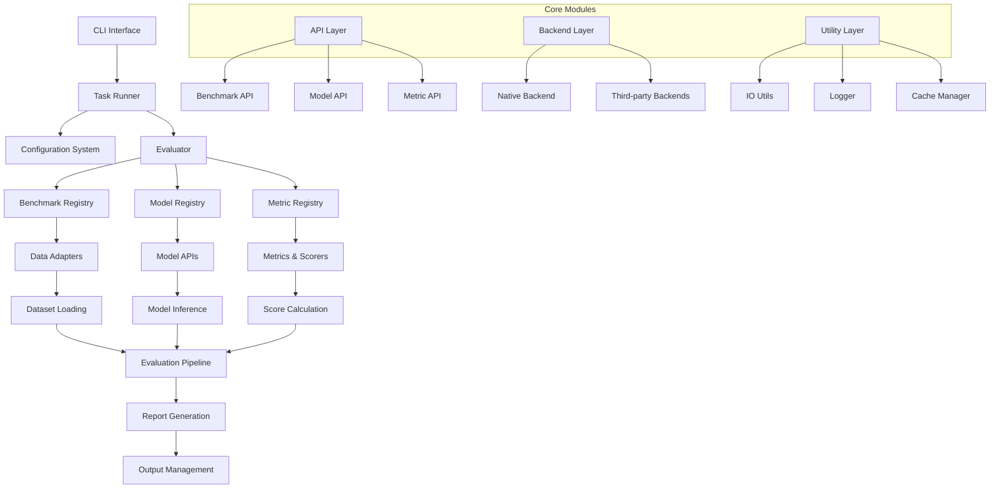
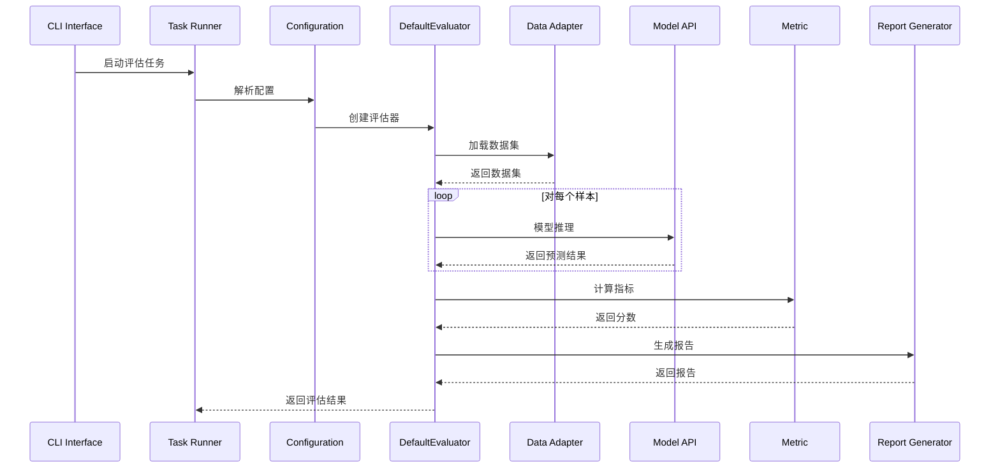

# EvalScope 项目架构分析

## 项目概述

EvalScope 是一个用于大语言模型（LLM）评估的综合性框架，提供了标准化的评估流程、丰富的基准测试数据集、多种评估指标和灵活的模型接口。该项目采用模块化设计，支持多种评估后端和自定义评估任务。

## 核心架构

### 1. 整体架构图



### 2. 目录结构分析

```
evalscope/
├── api/                    # 核心API层
│   ├── benchmark/          # 基准测试API
│   ├── dataset/           # 数据集API
│   ├── evaluator/         # 评估器API
│   ├── filter/            # 过滤器API
│   ├── metric/            # 指标API
│   ├── model/             # 模型API
│   ├── registry.py        # 注册中心
│   └── tool/              # 工具API
├── app/                   # Web应用
├── backend/               # 评估后端
├── benchmarks/            # 基准测试数据集
├── cli/                   # 命令行接口
├── collections/           # 数据集集合
├── config.py              # 配置管理
├── constants.py           # 常量定义
├── evaluator/             # 评估器实现
├── filters/               # 过滤器实现
├── metrics/               # 指标实现
├── models/                # 模型实现
├── perf/                  # 性能测试
├── report/                # 报告生成
├── run.py                 # 主运行入口
├── summarizer.py          # 结果汇总
├── third_party/           # 第三方集成
└── utils/                 # 工具函数
```

## 核心模块详解

### 1. API层 (api/)

API层是EvalScope的核心抽象层，定义了所有组件的接口规范：

#### **注册中心 (registry.py)**
```python
# 三大注册中心
BENCHMARK_REGISTRY: Dict[str, 'BenchmarkMeta'] = {}
MODEL_REGISTRY: Dict[str, Type['ModelAPI']] = {}
METRIC_REGISTRY: Dict[str, Type['Metric']] = {}
```

**功能**：
- 动态注册和检索基准测试、模型、指标
- 支持配置覆盖和元数据管理
- 提供统一的组件发现机制

#### **模型API (model/)**
```python
class ModelAPI(abc.ABC):
    @abc.abstractmethod
    def generate(self, input: List[ChatMessage], ...) -> ModelOutput
```

**支持的模型类型**：
- OpenAI兼容API
- ModelScope模型
- 本地模型
- 图像编辑模型
- 文本到图像模型

#### **基准测试API (benchmark/)**
```python
class DataAdapter(abc.ABC):
    @abc.abstractmethod
    def load_dataset(self) -> DatasetDict
```

**适配器类型**：
- `DefaultDataAdapter`: 标准文本生成
- `MultiChoiceAdapter`: 多选题
- `VisionLanguageAdapter`: 视觉语言
- `ImageEditAdapter`: 图像编辑
- `Text2ImageAdapter`: 文本到图像

### 2. 评估器 (evaluator/)

#### **DefaultEvaluator**
```python
class DefaultEvaluator(Evaluator):
    def eval(self) -> Report:
        # 1. 加载数据集
        dataset_dict = self.benchmark.load_dataset()
        
        # 2. 评估每个子集
        for subset, dataset in dataset_dict.items():
            subset_score = self.eval_subset(subset, dataset)
            
        # 3. 聚合分数
        # 4. 生成报告
```

**核心功能**：
- 数据集加载和预处理
- 模型推理执行
- 指标计算和聚合
- 缓存管理
- 报告生成

### 3. 配置系统 (config.py)

#### **TaskConfig**
```python
@dataclass
class TaskConfig(BaseArgument):
    # 模型相关
    model: Optional[Union[str, Model, ModelAPI]] = None
    model_id: Optional[str] = None
    model_args: Dict = field(default_factory=dict)
    
    # 数据集相关
    datasets: List[str] = field(default_factory=list)
    dataset_args: Dict = field(default_factory=dict)
    
    # 评估相关
    metrics: List[str] = field(default_factory=list)
    eval_backend: str = EvalBackend.NATIVE
    
    # 输出相关
    work_dir: str = DEFAULT_WORK_DIR
    use_cache: bool = True
```

### 4. 基准测试数据集 (benchmarks/)

EvalScope支持50+个基准测试数据集，涵盖：

#### **数据集分类**
- **通用能力**: MMLU, C-Eval, CMMLU
- **数学推理**: GSM8K, MATH, Competition Math
- **代码生成**: HumanEval, LiveCodeBench
- **多模态**: MMMU, MathVista, AI2D
- **中文能力**: C-Eval, CMMLU, Chinese Simple QA
- **专业领域**: HealthBench, Maritime Bench

#### **数据集注册机制**
```python
@register_benchmark(BenchmarkMeta(
    name='mmlu',
    version='0.0.1',
    description='Massive Multitask Language Understanding'
))
class MMLUAdapter(DefaultDataAdapter):
    def load_dataset(self) -> DatasetDict:
        # 数据集加载逻辑
```

### 5. 指标系统 (metrics/)

#### **指标类型**
- **自动指标**: ROUGE, BLEU, Exact Match
- **LLM评判**: 基于大模型的自动评判
- **数学解析**: 数学表达式解析和比较
- **多模态指标**: 图像生成质量评估

#### **指标接口**
```python
class Metric(abc.ABC):
    @abc.abstractmethod
    def score(self, predictions: List[str], references: List[str]) -> List[SampleScore]
```

### 6. 命令行接口 (cli/)

#### **主要命令**
```bash
evalscope eval          # 运行评估
evalscope perf          # 性能测试
evalscope app           # 启动Web应用
```

#### **命令结构**
```python
def run_cmd():
    parser = argparse.ArgumentParser('EvalScope Command Line tool')
    subparsers = parser.add_subparsers()
    
    PerfBenchCMD.define_args(subparsers)  # 性能测试
    EvalCMD.define_args(subparsers)       # 评估任务
    StartAppCMD.define_args(subparsers)    # Web应用
```

## 设计模式与架构特点

### 1. 注册模式 (Registry Pattern)
- 动态注册和发现组件
- 支持插件化扩展
- 配置驱动的组件选择

### 2. 适配器模式 (Adapter Pattern)
- 统一不同数据集的接口
- 支持多种模型API
- 灵活的指标计算方式

### 3. 策略模式 (Strategy Pattern)
- 多种评估后端支持
- 可插拔的指标计算策略
- 灵活的模型推理策略

### 4. 工厂模式 (Factory Pattern)
- 基于配置创建组件实例
- 支持动态组件选择
- 统一的组件初始化流程

## 评估流程

### 1. 完整评估流程



### 2. 关键步骤详解

#### **步骤1: 配置解析**
- 解析命令行参数或配置文件
- 验证模型和数据集可用性
- 设置输出目录和缓存策略

#### **步骤2: 组件初始化**
- 根据配置创建数据适配器
- 初始化模型API
- 注册评估指标

#### **步骤3: 数据集加载**
- 从基准测试加载数据
- 应用数据过滤和预处理
- 支持数据缓存和增量加载

#### **步骤4: 模型推理**
- 批量处理样本
- 支持流式输出和缓存
- 错误处理和重试机制

#### **步骤5: 指标计算**
- 并行计算多个指标
- 支持样本级和聚合级分数
- 自定义指标扩展

#### **步骤6: 报告生成**
- 生成详细的评估报告
- 支持多种输出格式
- 可视化结果展示

## 扩展性设计

### 1. 添加新基准测试
```python
@register_benchmark(BenchmarkMeta(
    name='custom_benchmark',
    version='1.0.0',
    description='Custom benchmark description'
))
class CustomBenchmarkAdapter(DefaultDataAdapter):
    def load_dataset(self) -> DatasetDict:
        # 实现数据集加载逻辑
        pass
```

### 2. 添加新模型API
```python
@register_model_api('custom_model')
class CustomModelAPI(ModelAPI):
    def generate(self, input: List[ChatMessage], ...) -> ModelOutput:
        # 实现模型推理逻辑
        pass
```

### 3. 添加新指标
```python
@register_metric('custom_metric')
class CustomMetric(Metric):
    def score(self, predictions: List[str], references: List[str]) -> List[SampleScore]:
        # 实现指标计算逻辑
        pass
```

## 性能优化

### 1. 缓存机制
- 模型预测结果缓存
- 数据集加载缓存
- 指标计算结果缓存

### 2. 并行处理
- 多线程模型推理
- 并行指标计算
- 批量数据处理

### 3. 内存管理
- 流式数据处理
- 内存映射文件
- 垃圾回收优化

## 总结

EvalScope是一个设计精良的大语言模型评估框架，具有以下特点：

1. **模块化设计**: 清晰的API层和实现层分离
2. **高度可扩展**: 支持自定义基准测试、模型和指标
3. **标准化流程**: 统一的评估流程和报告格式
4. **性能优化**: 缓存、并行处理和内存优化
5. **易于使用**: 简洁的CLI接口和配置系统
6. **丰富生态**: 50+基准测试数据集和多种评估指标

该架构为LLM评估提供了完整的解决方案，既满足了标准化评估的需求，又保持了足够的灵活性来适应不同的评估场景。
