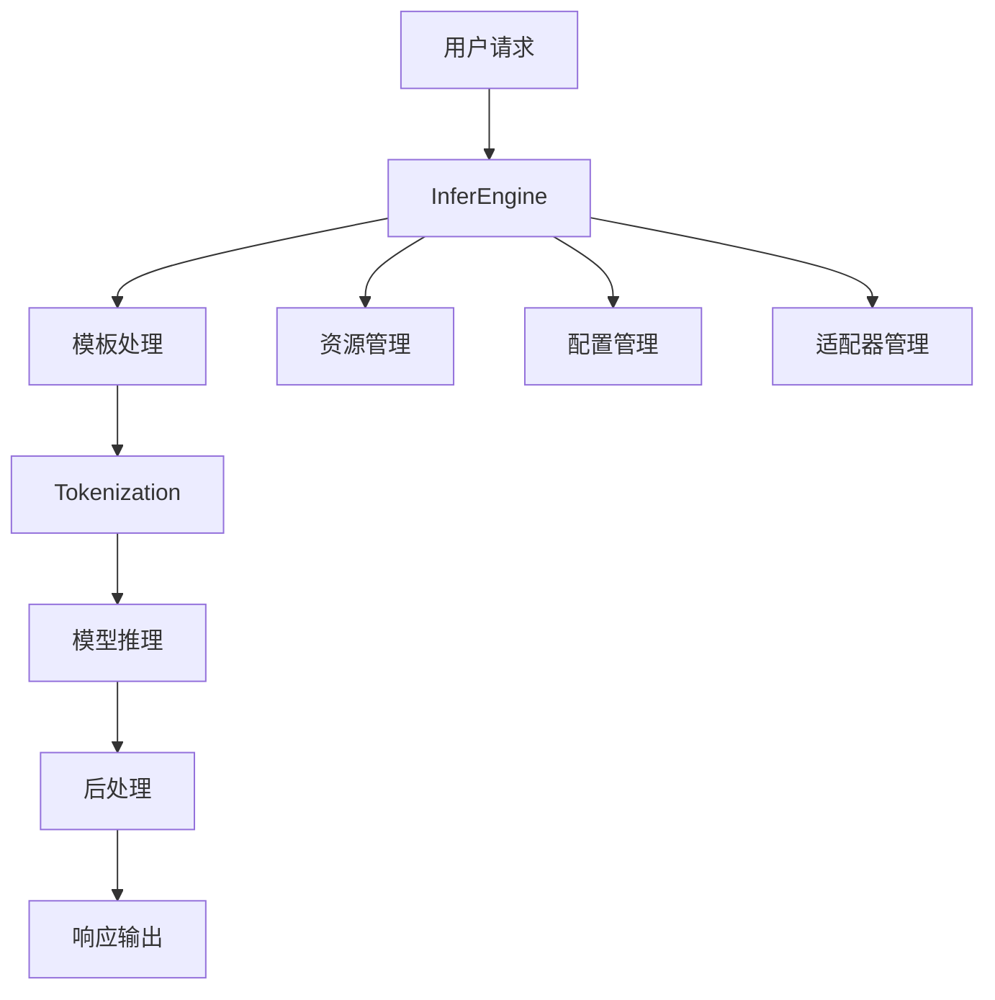
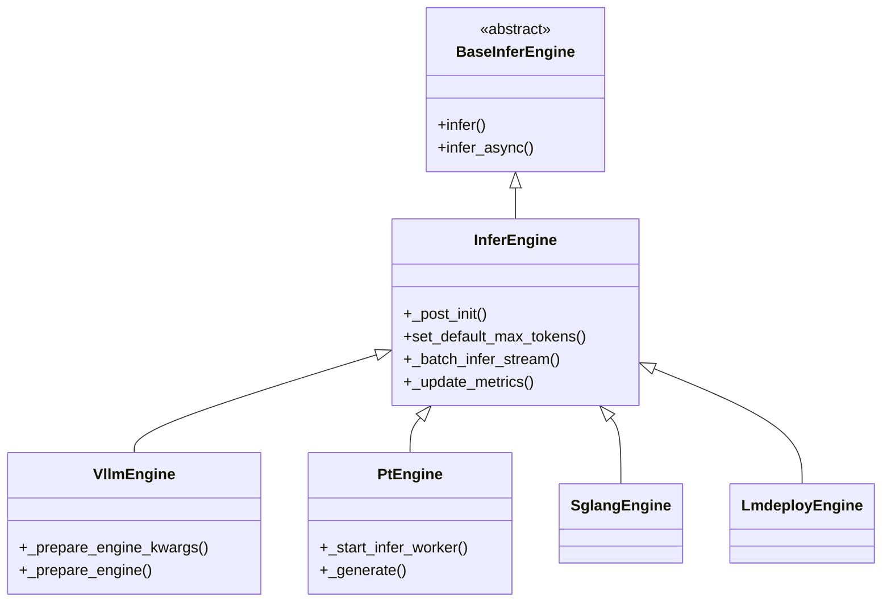
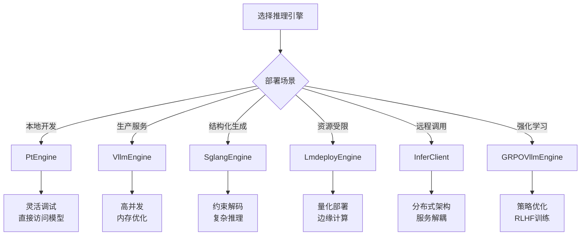

# Swift LLM 推理引擎架构分析

## 概述

本文档分析了 `code/ms-swift/swift/llm/infer/infer_engine` 目录下的推理引擎架构，回答了关于推理引擎设计、功能和实现的三个核心问题。

## 1. 什么是 infer engine？用来做什么的？承担了模型推理的那一部分任务？

### 定义与作用
**Infer Engine（推理引擎）** 是大语言模型推理系统的核心组件，负责将用户输入转换为模型输出的整个流程。它承担了以下关键任务：

1. **请求处理与调度**：
   - 接收并解析用户的推理请求（`InferRequest`）
   - 管理批处理和并发请求
   - 提供同步和异步推理接口

2. **模型加载与管理**：
   - 初始化和配置大语言模型
   - 管理模型权重、配置和元数据
   - 支持适配器（LoRA）的动态加载和切换

3. **文本处理**：
   - 使用模板（Template）系统进行输入预处理
   - 处理 tokenization 和 detokenization
   - 管理停止词和特殊令牌

4. **生成控制**：
   - 配置生成参数（温度、top-k、top-p等）
   - 实现流式输出和批量输出
   - 处理工具调用（tool calling）功能

5. **资源管理**：
   - 内存和GPU资源的优化使用
   - 支持分布式推理（张量并行、流水线并行）
   - KV缓存管理和优化

### 在模型推理中的位置


## 2. 怎样设计一个 engine？一个合格的 engine 应当有怎样的基本功能？

### 基础架构设计

基于代码分析，一个合格的推理引擎应当遵循以下设计原则：

#### 2.1 抽象基类设计（`BaseInferEngine`）
```python
class BaseInferEngine(ABC):
    @abstractmethod
    def infer(self, infer_requests, request_config, metrics, **kwargs)
    
    @abstractmethod
    async def infer_async(self, infer_request, request_config, **kwargs)
```

#### 2.2 核心功能模块

**必备功能**：
1. **统一接口**：
   - 同步推理接口 (`infer`)
   - 异步推理接口 (`infer_async`)
   - 支持批处理和流式输出

2. **配置管理**：
   - 模型配置加载和验证
   - 生成参数配置（`GenerationConfig`）
   - 请求配置处理（`RequestConfig`）

3. **模板系统集成**：
   - 支持多种对话模板
   - 输入预处理和输出后处理
   - 工具调用格式化

4. **资源优化**：
   - 内存管理和GPU利用率优化
   - 批处理优化
   - 缓存机制

5. **错误处理与监控**：
   - 异常处理机制
   - 性能指标收集（`Metric`）
   - 进度监控（tqdm集成）

#### 2.3 扩展性设计
- **适配器支持**：动态LoRA加载
- **多模态支持**：图像、音频等输入处理
- **分布式支持**：多GPU、多节点部署
- **后端抽象**：支持不同的推理后端

### 设计模式


## 3. infer_engine 文件夹下定义的 engine 彼此之间有什么区别？

### 3.1 引擎类型对比

| 引擎类型 | 底层框架 | 主要特点 | 适用场景 |
|---------|----------|----------|----------|
| **VllmEngine** | vLLM | 高并发、PagedAttention、内存优化 | 生产环境、高并发服务 |
| **PtEngine** | PyTorch原生 | 直接模型调用、灵活性高 | 开发调试、单机推理 |
| **SglangEngine** | SGLang | 结构化生成、约束解码 | 结构化输出、复杂推理 |
| **LmdeployEngine** | LMDeploy | TurboMind优化、量化支持 | 边缘部署、资源受限环境 |
| **GRPOVllmEngine** | vLLM扩展 | 强化学习优化、GRPO算法 | 强化学习训练、策略优化 |
| **InferClient** | HTTP客户端 | 远程调用、服务解耦 | 分布式系统、微服务架构 |

### 3.2 详细特性分析

#### VllmEngine
- **核心特性**：
  - PagedAttention内存管理
  - 连续批处理（Continuous Batching）
  - 张量并行和流水线并行
  - LoRA适配器支持
  - 前缀缓存优化

- **配置参数**：
  ```python
  gpu_memory_utilization=0.9
  tensor_parallel_size=1
  max_num_seqs=256
  enable_prefix_caching=False
  ```

#### PtEngine
- **核心特性**：
  - 直接PyTorch模型调用
  - 线程池批处理
  - 灵活的生成配置
  - 本地适配器加载

- **工作机制**：
  - 维护任务队列和线程池
  - 支持动态批处理
  - 直接访问模型权重

#### SglangEngine
- **核心特性**：
  - 结构化生成语言支持
  - 约束解码
  - 高效的KV缓存
  - 数据并行支持

#### LmdeployEngine
- **核心特性**：
  - TurboMind推理引擎
  - INT4/INT8量化支持
  - 视觉模型支持
  - 轻量化部署

#### GRPOVllmEngine
- **核心特性**：
  - 继承VllmEngine功能
  - 支持GRPO强化学习算法
  - 特殊的输出格式（`RolloutOutput`）
  - 策略梯度优化

#### InferClient
- **核心特性**：
  - HTTP/REST API客户端
  - 异步网络请求
  - 远程模型调用
  - 服务发现和负载均衡

### 3.3 引擎选择指南



## 4. 架构总结

### 4.1 统一抽象层
所有引擎都继承自 `BaseInferEngine`，提供统一的接口：
- 标准化的输入输出格式
- 一致的配置管理
- 统一的错误处理机制

### 4.2 可插拔设计
- 支持多种推理后端
- 灵活的适配器机制
- 模块化的组件设计

### 4.3 性能优化策略
- 批处理和并发优化
- 内存和缓存管理
- 分布式推理支持

### 4.4 扩展性考虑
- 新引擎类型易于集成
- 支持自定义后端
- 插件化的功能扩展

这种设计使得Swift框架能够支持多种推理场景，从开发调试到生产部署，从单机推理到分布式服务，提供了完整的解决方案。

## 5. PtEngine 的 `from_model_template()` 方法深入分析

### 5.1 方法签名与参数解析

```python
@classmethod
def from_model_template(cls, model, template=None, *, max_batch_size: int = 1):
    self = super().__new__(cls)
    self.model = model
    self.processor = template.processor
    self.max_batch_size = max_batch_size
    self._post_init(template)
    return self
```

### 5.2 参数详解

#### **model 参数**
- **类型**: `PreTrainedModel` (通常是 Transformers 模型)
- **含义**: 已经加载好的PyTorch模型实例
- **来源**: 通常通过以下方式获得：
  ```python
  # 1. 直接加载
  model, tokenizer = get_model_tokenizer(model_dir, device_map='auto')
  
  # 2. 加载带适配器的模型
  model = AutoModelForCausalLM.from_pretrained(model_dir, ...)
  model = Swift.from_pretrained(model, adapter_dir)  # 加载LoRA等适配器
  ```

#### **template 参数**
- **类型**: `Template` (继承自 `ProcessorMixin`)
- **含义**: 对话模板对象，负责格式化输入输出
- **核心组件**:
  - `template.processor`: 包含tokenizer和可能的图像处理器
  - 对话格式化规则（如ChatML、Alpaca等格式）
  - 停止词和特殊令牌处理规则
- **来源**: 通常通过 `get_template()` 获得：
  ```python
  template = get_template(model.model_meta.template, tokenizer)
  ```

### 5.3 方法处理流程

```mermaid
graph TB
    A[from_model_template调用] --> B[创建新实例 super().__new__]
    B --> C[设置model属性]
    C --> D[从template提取processor]
    D --> E[设置max_batch_size]
    E --> F[调用_post_init初始化]
    F --> G[返回完整的PtEngine实例]
    
    F --> H[_post_init详细处理]
    H --> I[设置model_info等元数据]
    H --> J[初始化default_template]
    H --> K[创建adapters_pool]
    H --> L[设置generation_config]
```

### 5.4 核心处理逻辑

#### **ProcessorMixin 的作用**
```python
class ProcessorMixin:
    @property
    def tokenizer(self):
        tokenizer = self.processor
        if not isinstance(tokenizer, PreTrainedTokenizerBase) and hasattr(tokenizer, 'tokenizer'):
            tokenizer = tokenizer.tokenizer
        return tokenizer
```

这个设计使得：
- `template.processor` 可能是 tokenizer，也可能是包含 tokenizer 的复合处理器
- 通过 `ProcessorMixin`，PtEngine 可以统一访问 tokenizer

#### **_post_init 处理**
在 `_post_init(template)` 中执行关键初始化：
1. **模型元数据提取**:
   ```python
   self.model_info = processor.model_info
   self.model_meta = processor.model_meta  
   self.max_model_len = self.model_info.max_model_len
   ```

2. **模板系统初始化**:
   ```python
   self.default_template = template
   template.init_processor(self.processor)
   ```

3. **适配器池初始化**:
   ```python
   self._adapters_pool = {}
   ```

### 5.5 使用场景分析

基于代码搜索结果，`from_model_template()` 主要用于以下场景：

#### **场景1: 推理服务**
```python
# swift/llm/infer/infer.py
model, self.template = prepare_model_template(args)
self.infer_engine = PtEngine.from_model_template(model, self.template, max_batch_size=args.max_batch_size)
```

#### **场景2: 强化学习训练**
```python
# swift/trainers/rlhf_trainer/grpo_trainer.py  
self.engine = PtEngine.from_model_template(self.model, copy(self.template), max_batch_size=0)  # 0: no limit
```

#### **场景3: 模型评估**
```python
# swift/llm/eval/utils.py
self.engine = PtEngine.from_model_template(self.model, self.template, max_batch_size=self.config.batch_size)
```

#### **场景4: 奖励模型**
```python
# swift/plugin/rm_plugin.py
self.engine = PtEngine.from_model_template(self.model, self.template, max_batch_size=0)  # 0: no limit
```

### 5.6 设计优势

1. **解耦设计**: 将模型加载和引擎创建分离，提高灵活性
2. **资源复用**: 直接使用已加载的模型，避免重复加载
3. **配置灵活**: 支持不同的批处理大小配置
4. **模板集成**: 无缝集成对话模板系统
5. **适配器支持**: 天然支持LoRA等适配器技术

### 5.7 与常规构造函数的区别

| 方面 | `__init__()` | `from_model_template()` |
|------|-------------|------------------------|
| **模型加载** | 内部加载模型 | 使用外部已加载模型 |
| **资源控制** | 引擎控制整个生命周期 | 模型可被外部管理 |
| **灵活性** | 配置相对固定 | 高度灵活，支持动态配置 |
| **使用场景** | 独立推理服务 | 集成到更大系统中 |
| **内存效率** | 可能重复加载 | 避免重复加载 |

这种工厂方法模式特别适合于需要在已有模型基础上快速创建推理引擎的场景，是Swift框架灵活性设计的重要体现。
